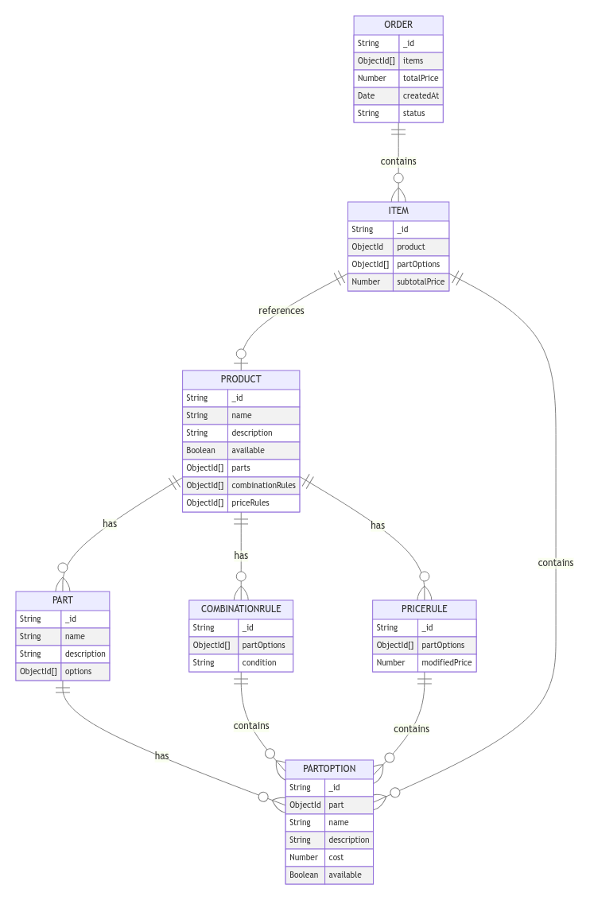

## Usage

### Option 1: Do it yourself

1. **Clone the repository**:

    ```bash
    git clone https://github.com/ViloCat/biketorial
    cd biketorial
    ```

2. **Install the dependencies**:

    ```bash
    npm install
    ```

3. **Set up MongoDB**:
    - Ensure you have MongoDB running. You can use a cloud instance like MongoDB Atlas or a local instance.
    - Create a `.env` file in the root directory and add your MongoDB connection string. If you don't want to provide your own MongoDB instance, the `MONGO_URI` for the running instance will be provided in file sent to your email:

    ```env
    MONGO_URI=<uri>
    PORT=3000
    ```

4. **Start the server**:

    ```bash
    npm start
    ```

5. **Open your browser**:
    - Navigate to `http://localhost:3000` for the customer interface.
    - Navigate to `http://localhost:3000/admin` for the admin panel.

### Option 2: Using Docker

1. **Clone the repository**:

    ```bash
    git clone https://github.com/ViloCat/biketorial
    cd biketorial
    ```

2. **Set up MongoDB**:
    - Create a `.env` file in the root directory and add your MongoDB connection string. If you don't want to provide your own MongoDB instance, the `MONGO_URI` for the running instance will be provided in the file sent to your email:

    ```env
    MONGO_URI=<uri>
    PORT=3000
    ```

3. **Build and run the Docker container**:

    ```bash
    docker-compose up --build
    ```

4. **Open your browser**:
    - Navigate to `http://localhost:3000` for the customer interface.
    - Navigate to `http://localhost:3000/admin` for the admin panel.

### Option 3: Already running instance

1. **Access the running instance**:

    - Navigate to `https://biketorial.onrender.com` for the customer interface.
    - Navigate to `https://biketorial.onrender.com/admin` for the admin panel.


## Project Overview

### General Approach

Our approach to this project was to balance the requirements of a technical interview challenge with the practical considerations of solving a real-world problem. We aimed to create a solution that not only meets the specific requirements of the exercise but also lays the groundwork for a potential working Minimum Viable Product (MVP).

### Architecture

We selected the MVC (Model-View-Controller) architecture for its simplicity and effectiveness, making it an ideal choice for a project like this. Given that this is Marcus's first shop, and the project may evolve with frequent updates, MVC offers a straightforward yet robust framework. It allows for a clear separation of concerns, ensuring that the application remains easy to manage, maintain, and extend as the business grows. While more complex architectures like hexagonal or clean architecture provide advanced features, MVC strikes the right balance between simplicity and functionality for this stage of the project.

### Tech Stack
We selected the following tech stack to meet the specific needs of this project:

- **Node.js**: Chosen for its non-blocking, event-driven architecture, which excels at handling multiple requests efficiently, making it ideal for building scalable applications.
- **Express.js**: A minimal and flexible web application framework for Node.js that offers a robust set of features, simplifying the development of both web and mobile applications.
- **MongoDB**: A NoSQL database known for its flexible schema design, perfectly suited for managing the dynamic and complex data structures typical of an e-commerce platform.

On the frontend, while the primary focus was on backend development, we implemented a simple yet functional interface:

- **Bootstrap**: Utilized for its responsive design capabilities and ease of use, Bootstrap allowed us to quickly develop a clean and functional interface without delving deep into frontend architecture.

The frontend, built with basic HTML, CSS, and JavaScript, was not the main focus of this project. However, it was developed to a sufficient level to effectively test the backend and provide a usable interface for interacting with the core functionalities. Apologies in advance for having larger chunks of code in the frontend logic; this approach was taken to keep the interface development straightforward and to ensure the core functionalities could be tested effectively. Our emphasis was on building a strong and scalable backend, while still ensuring that the application remains accessible and functional.


### Current Status and Areas for Improvement

The project is currently functional, but there are several key features and enhancements that remain to be implemented to achieve a production-ready application:

- **Authentication**: User authentication and authorization mechanisms are not yet in place. As a result, the routes for customer and admin functionalities are not protected, and the database operates under the assumption that all actions are performed by a single user.
- **Frontend Code Organization**: The frontend code, while functional, would benefit from improved organization and structure to enhance maintainability and scalability.
- **Testing**: Comprehensive unit and integration tests are currently lacking, which are essential for ensuring the reliability and robustness of the application.
- **Internationalization (i18n)**: Support for multiple languages is not yet implemented, limiting the application's accessibility for non-English-speaking users.
- **Edge Case Handling**: Additional validation is needed to manage complex edge cases. This includes handling overlapping rules, such as conflicting price or combination rules, dynamic changes in product pricing, stock availability, and other conditions that could affect order processing. While we have implemented double validation (both frontend and backend) for certain rules, further refinement in middleware is required.
- **Error Handling**: The current error handling system is basic, often returning generic 500 status codes. Implementing a more robust error handling system with custom error classes and centralized error handling middleware would improve reliability and maintainability.
- **Input Validation**: Implementing input validation using libraries like Joi or express-validator would ensure that all incoming data is validated before it reaches the controllers, improving security and data integrity.
- **Separation of Concerns**: The controllers are currently handling too many responsibilities. Introducing a service layer to handle business logic would improve code organization and make the application easier to maintain and extend.
- **Environment Configuration**: Implementing a configuration management system to handle different environments (development, staging, production) would allow for smoother transitions between these environments and better management of environment-specific settings.
- **Logging**: A proper logging system should be implemented to replace console.log and console.error, providing better monitoring and debugging capabilities, especially in production environments.
- **API Documentation**: Using a tool like Swagger to document API endpoints would make the API more accessible to other developers and easier to maintain.
- **Code Duplication**: There's some code duplication in the controllers, which could be refactored into shared utility functions to improve code reuse and maintainability.
- **Async/Await Consistency**: The project currently mixes async/await with .then() syntax. Standardizing on async/await throughout the codebase would improve readability and consistency.
- **Security**: Implementing security best practices such as rate limiting, CORS configuration, and input sanitization is essential to protect the application from common web vulnerabilities.
- **Database Transactions**: Using database transactions for operations that modify multiple documents would ensure data consistency, particularly in complex operations involving multiple models.
- **Code Style**: Implementing a linter (like ESLint) and a code formatter (like Prettier) would enforce consistent code style across the project, improving readability and reducing errors.
- **Dependency Injection**: Introducing a dependency injection container could enhance modularity and testability, making the application more flexible and easier to maintain.
- **Pagination**: Implementing pagination for endpoints that return lists of items would improve performance and user experience, particularly as the dataset grows.
- **Caching**: Implementing caching strategies where appropriate would improve performance by reducing the load on the database and speeding up response times.
- **Other Essential Features**:
  - **Product Images**: The ability to add and display images for products is currently missing, which is crucial for any e-commerce platform to provide a visually appealing and informative shopping experience.
  - **Search and Filtering**: Implementing search functionality and advanced filtering options would significantly enhance the user experience by allowing customers to find products more easily.
  - **Shopping Cart and Checkout**: A fully functional shopping cart and checkout process need to be developed to handle multiple products in an order and manage payment processing.
  - **Order Management**: Admin features for viewing, processing, and managing orders are not yet implemented but are essential for operational efficiency.

These features and enhancements are crucial for transitioning the project from a functional prototype to a production-ready application. Future iterations will prioritize these improvements to secure the application, support multiple users and languages, handle edge cases more effectively, and bring the project closer to production standards.

## Implementation

Data model:



The data model is designed to support the hierarchical structure of products, parts, and part options, as well as the rules that govern their combinations and pricing.

#### Hierarchy

1. **Product**
   - Represents a bicycle or any other item Marcus wants to sell.
   - Contains references to parts and rules.

2. **Part**
   - Represents a component of the product (e.g., frame, wheels).
   - Contains references to part options.

3. **PartOption**
   - Represents a specific choice for a part (e.g., matte finish, mountain wheels).
   - Contains details like name, description, cost, and availability.

#### Combination Rules
Combination rules define which part options can or cannot be selected together. They ensure that incompatible or exclusive options are not chosen simultaneously.

- **Incompatible Rule**: Disables part options that cannot be combined with the selected options.
- **Exclusive Rule**: Ensures that only one option from a set of exclusive options can be selected.

#### Price Rules
Price rules modify the total price based on the selected part options. They allow for dynamic pricing depending on the combination of options chosen. Additionally, price rules have been implemented to show discounts, free promotional items, etc.

### Cart Persistence

When a customer adds a product to the cart, the selected options and calculated price are stored in an order document in the database. The order document includes:

- Product ID
- Selected part options
- Subtotal price for each item
- Total price for the order
- Order status (e.g., in_cart, completed)

### Optimistic Frontend

The frontend is designed to be optimistic, meaning it assumes operations will succeed and updates the UI immediately. This approach provides a smoother user experience. For example:

- When a customer selects part options, the UI immediately updates the total price.
- When the "Add to Cart" button is clicked, the item is added to the cart in the UI before the backend confirms the operation.

If the backend operation fails, the frontend can roll back the changes and display an error message to the user.


## Exercise Statement

Factorial Tech Challenge
Bicycle Shop
You're tasked with building a website that allows Marcus, a bicycle shop owner, to sell his bicycles.


Marcus owns a growing business and now wants to sell via the internet. He also tells you that bicycles are his main product, but if the business continues to grow, he will surely start selling other sports-related items such as skis, surfboards, roller skates, etc. It would be a nice bonus if the same website allowed him to sell those things as well.


What makes Marcus's business successful is that customers can completely customize their bicycles. They can select many different options for the various parts of the bicycle. Here is an incomplete list of all the parts and their possible choices, to give an example:

Frame type: Full-suspension, diamond, step-through
Frame finish: Matte, shiny
Wheels: Road wheels, mountain wheels, fat bike wheels
Rim color: Red, black, blue
Chain: Single-speed chain, 8-speed chain


On top of that, Marcus points out that there are some combinations that are prohibited because they are not possible in reality. For example:

If you select "mountain wheels", then the only frame available is the full suspension.
If you select "fat bike wheels", then the red rim color is unavailable because the manufacturer doesn't provide it.


Also, sometimes Marcus doesn't have all the possible variations of each part in stock, so he also wants to be able to mark them as "temporarily out of stock" to avoid incoming orders that he would not be able to fulfill.


Finally, Marcus tells you how to calculate the price that you should present to the customer after the customization of the bicycle. Normally, this price is calculated by adding up the individual prices of each part that you selected. For example:

Full suspension = 130 EUR
Shiny frame = 30 EUR
Road wheels = 80 EUR
Rim color blue = 20 EUR
Chain: Single-speed chain = 43 EUR
Total price: 130 + 30 + 80 + 20 + 43 = 303 EUR

However, the price of some options might depend on others. For instance, the frame finish is applied at the end over the whole bicycle, so the more area to cover, the more expensive it gets. Because of that, the matte finish over a full-suspension frame costs 50 EUR, while applied over a diamond frame it costs 35 EUR.


These kinds of variations can always happen and they might depend on any of the other choices (not only two), so Marcus asks you to consider this because otherwise, he would be losing money.

This code exercise consists of defining a software architecture that could satisfy the requirements described above. In particular:

Data model: What data model would be best to support this application? Could you describe it? Include table specifications (or documents if it's a non-relational database) with fields, their associations, and the meaning of each entity.
The description of the main customer actions in this e-commerce website. Explain how they would work in detail.
The product page: This would be a read operation, performed when you need to display the page of a product (a bicycle) for the customer to purchase. How would you present this UI? How would you calculate which options are available or not? How would you calculate the price depending on the customer's selections?
The "add to cart" action: Following the previous point, the product page should have a button to "add to cart" after the customer has made some specific selection. What happens when the customer clicks this button? What is persisted in the database?
The description of the main workflows from the administration part of the website, where Marcus configures the store.
The creation of a new product: What information is required to create a new product? What changes in the database after performing this action?
The addition of a new part choice: How can Marcus introduce a new rim color, for example? Can you describe the UI? What changes in the database after this action?
Setting up prices: How can Marcus change the price of a specific part (like the diamond frame type) or specify that some combinations of choices have particular prices? How does the UI look? How does the database change to store this information?
We expect you to provide the main core model of the solution: a set of classes/functions/modules in the language of your choice that can describe the main relationships between entities and any supporting materials you find useful (database schemas, diagrams, etc). Please make it as lightweight as possible: no need to use web frameworks or provide the finished solution, the goal is to see how you model and code the domain logic.


For any other specification of the system that's not directly stated in the exercise, feel free to interpret it as you see best.
